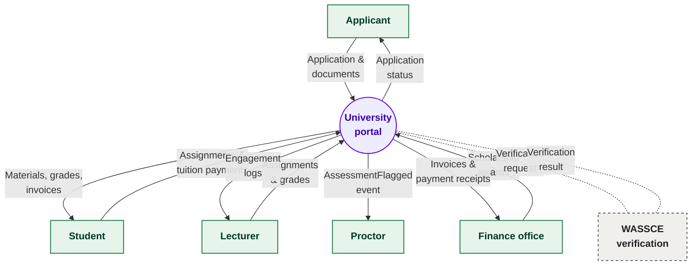

```mermaid
flowchart TD
    %% Node Definitions
    Applicant["Applicant"]
    Student["Student"]
    Lecturer["Lecturer"]
    Proctor["Proctor"]
    Finance["Finance office"]
    WASSCE["WASSCE<br/>verification"]
    Portal(("University<br/>portal"))

    %% Data Flows
    Applicant -->|"Application &<br/>documents"| Portal
    Portal -->|"Application<br/>status"| Applicant

    Student -->|"Assignments &<br/>tuition payments"| Portal
    Portal -->|"Materials, grades,<br/>invoices"| Student

    Lecturer -->|"Assignments<br/>& grades"| Portal
    Portal -->|"Engagement<br/>logs"| Lecturer

    Portal -->|"AssessmentFlagged<br/>event"| Proctor

    Finance -->|"Scholarship<br/>awards"| Portal
    Portal -->|"Invoices &<br/>payment receipts"| Finance

    Portal -.-|Verification<br/>request| WASSCE
    WASSCE -.-|Verification<br/>result| Portal

    %% Styling & Colors
    classDef actorStyle fill:#e6f4ea,stroke:#2d7d52,stroke-width:1.5px,color:#043927,font-weight:bold;
    classDef externalStyle fill:#f1efeb,stroke:#5f6368,stroke-width:1.5px,stroke-dasharray: 4 4,color:#202124,font-weight:bold;
    classDef portalStyle fill:#eeedff,stroke:#6200ee,stroke-width:1.5px,color:#3700b3,font-weight:bold;

    class Applicant,Student,Lecturer,Proctor,Finance actorStyle;
    class WASSCE externalStyle;
    class Portal portalStyle;
```