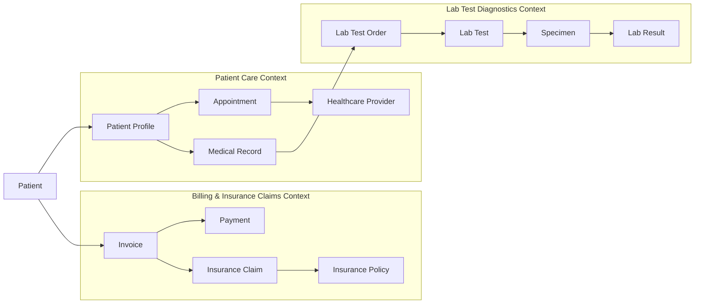

```mermaid
flowchart LR
    Patient["Patient"]

    subgraph PC["Patient Care Context"]
        PatientProfile["Patient Profile"]
        Appointment["Appointment"]
        Provider["Healthcare Provider"]
        MedicalRecord["Medical Record"]
    end

    subgraph BI["Billing & Insurance Claims Context"]
        Invoice["Invoice"]
        Payment["Payment"]
        InsuranceClaim["Insurance Claim"]
        InsurancePolicy["Insurance Policy"]
    end

    subgraph LD["Lab Test Diagnostics Context"]
        TestOrder["Lab Test Order"]
        LabTest["Lab Test"]
        Specimen["Specimen"]
        LabResult["Lab Result"]
    end

    Patient --> PatientProfile
    PatientProfile --> Appointment
    Appointment --> Provider
    PatientProfile --> MedicalRecord

    Patient --> Invoice
    Invoice --> Payment
    Invoice --> InsuranceClaim
    InsuranceClaim --> InsurancePolicy

    MedicalRecord --> TestOrder
    TestOrder --> LabTest
    LabTest --> Specimen
    Specimen --> LabResult
```